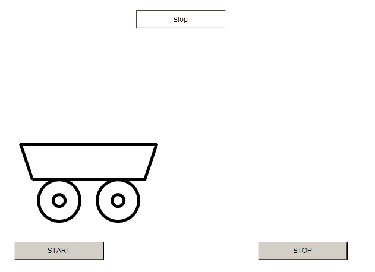

# Programmazione dei PLC

In questa sezione sono descritti i principi per la programmazione dei PLC

## Caratteristiche di un PLC

Il PLC (Programmable Logic Controller) è un dispositivo utilizzato nell'ambito dell'automazione industriale. Presenta molte caratteristiche in comune con i Personal Computer, ma al contrario di questi è progettato per un funzionamento continuo (H24) ed in condizioni di temperatura, umidità o polvere più proibitive.
Il PLC ha progressivamente sostituito la logica cablata nell'ambito dell'automazione industriale per i seguenti motivi:

- Possibilità di riprogrammare il sistema automatico senza modifiche hardware.
- Minor presenza di parti in movimento (relè elettromeccanici).
- Minore consumo di elettricità.
- Minore costo di realizzazione.

## Linguaggio Ladder

## Blocchi funzione

Un Blocco Funzione FB (Function Block) è una POU (Program Organization Unit) che, a fronte di uno più ingressi, restituisce uno o più uscite. Non può essere richiamato direttamente, ma dev'essere dichiarato sotto forma di istanza. Ogni istanza ha uno stato di memoria (tramite l'utilizzo di variabili interne) che persiste tra una chiamata e l'altra dell'istanza del blocco funzione.

### Timer on-delay (TON)

Il Function Block TON (Timer ON Delay) è utilizzato per creare un ritardo temporizzato.

<figure markdown="span">
  { width="300" }
  <figcaption markdown="span">
    Blocco funzione TON
  </figcaption>
</figure>

Di seguito viene descritto il principio di funzionamento.

- L'ingresso di abilitazione (IN) determina se il blocco è abilitato o disabilitato. Finché l'ingresso rimane a livello logico **FALSE**, il blocco è disabilitato e l'uscita Q è a livello logico **FALSE**. Quando invece viene portato a **TRUE**, il blocco inizia a contare il tempo trascorso. Il tempo trascorso è disponibile nell'uscita Elapsed TIme (ET).

- L'ingresso Preset Time (PT) definisce la durata del ritardo temporizzato. Quando il tempo trascorso supera il tempo impostato nell'ingresso PT, l'uscita Q viene posta a livello logico **TRUE** e vi permane finché il segnale IN rimane a livello logico **TRUE**.

- Se l'ingresso IN viene posto a **FALSE** prima che il tempo PT sia trascorso, l'uscita Q non assumerà il valore logico **TRUE**.

- Per effettuare un altro conteggio, l'ingresso IN deve essere portato a livello logico **FALSE** e successivamente a livello logico **TRUE**.

### Timer off-delay (TOF)

Il Function Block TON (Timer ON Delay) è utilizzato per creare un ritardo temporizzato ed il suo funzionamento è duale rispetto al blocco TON.

<figure markdown="span">
  { width="300" }
  <figcaption markdown="span">
    Blocco funzione TOF
  </figcaption>
</figure>

- L'ingresso di abilitazione (IN) determina se il blocco è abilitato o disabilitato. Finché l'ingresso rimane a livello logico **TRUE**, il blocco è disabilitato e l'uscita Q è a livello logico **TRUE**. Quando invece viene portato a **FALSE**, il blocco inizia a contare il tempo trascorso. Il tempo trascorso è disponibile nell'uscita Elapsed TIme (ET).

- L'ingresso Preset Time (PT) definisce la durata del ritardo temporizzato. Quando il tempo trascorso supera il tempo impostato nell'ingresso PT, l'uscita Q viene posta a livello logico **FALSE** e vi permane finché il segnale IN rimane a livello logico **FALSE**.

- Se l'ingresso IN viene posto a **TRUE** prima che il tempo PT sia trascorso, l'uscita Q non assumerà il valore logico **FALSE**.

- Per effettuare un altro conteggio, l'ingresso IN deve essere portato a livello logico **TRUE** e successivamente a livello logico **FALSE**.

### Pulse Timer (TP)

Il Function Block TP (Pulse timer) è utilizzato per generare un impulso di durata predefinita.

<figure markdown="span">
  { width="300" }
  <figcaption markdown="span">
    Blocco funzione TP
  </figcaption>
</figure>

Di seguito viene descritto il principio di funzionamento.

- L'ingresso di abilitazione (IN) determina se il blocco è abilitato o disabilitato. Finché l'ingresso rimane a livello logico **FALSE**, il blocco è disabilitato e l'uscita Q è a livello logico **FALSE**. Quando invece viene portato a **TRUE**, l'uscita Q viene portata a livello logico **TRUE**.

- L'ingresso Preset Time (PT) definisce la durata dell'impulso temporizzato. Quando il tempo trascorso supera il tempo impostato nell'ingresso PT, l'uscita Q viene posta a livello logico **FALSE**.

- Se l'ingresso IN viene posto a **FALSE** prima che il tempo PT sia trascorso, l'uscita Q rimane comunque a livello logico **TRUE** finché non è trascorso il tempo impostato in PT.

- Per generare un altro impulso, l'ingresso IN deve essere portato a livello logico **FALSE** e successivamente a livello logico **TRUE**.

### Rising Edge Trigger (R_TRIG)

Il Function Block R_TRIG (Rising Edge Trigger) è utilizzato per rilevare un fronte di salita (passaggio da livello logico **FALSE** a livello logico **TRUE**) sull'ingresso CLK.

<figure markdown="span">
  { width="300" }
  <figcaption markdown="span">
    Blocco funzione R_TRIG
  </figcaption>
</figure>

Di seguito viene descritto il principio di funzionamento.

- Quando il segnale di ingresso CLK passa da livello logico **FALSE** a livello logico **TRUE**, l'uscita Q viene portata a livello logico **TRUE** solamente per un ciclo del PLC.

### Rising Edge Trigger (F_TRIG)

Il Function Block F_TRIG (Falling Edge Trigger) è utilizzato per rilevare un fronte di discesa (passaggio da livello logico **TRUE** a livello logico **FALSE**) sull'ingresso CLK.

<figure markdown="span">
  { width="300" }
  <figcaption markdown="span">
    Blocco funzione F_TRIG
  </figcaption>
</figure>

Di seguito viene descritto il principio di funzionamento.

- Quando il segnale di ingresso CLK passa da livello logico **TRUE** a livello logico **FALSE**, l'uscita Q viene portata a livello logico **TRUE** solamente per un ciclo del PLC.

### Down Counter (CTD)

Il Function Block CTD (Down Counter) permette di contare all'indietro.

<figure markdown="span">
  { width="300" }
  <figcaption markdown="span">
    Blocco funzione CTD
  </figcaption>
</figure>

Di seguito viene descritto il principio di funzionamento.

- Quando l'ingresso LOAD ha valore logico **TRUE**, la variabile di conteggio CV viene inizializzata con il valore contenuto nella variabile d'ingresso PV (preset value). Se la variabile di ingresso CD ha un fronte di salita da **FALSE** a **TRUE**, CV viene decrementato di 1, finché CV è maggiore di zero. Il valore di Q vale **TRUE** quando CV è minore o uguale a zero.

### Up Counter (CUD)

Il Function Block CUD (Down Counter) permette di contare in avanti.

<figure markdown="span">
  { width="300" }
  <figcaption markdown="span">
    Blocco funzione CUD
  </figcaption>
</figure>

Di seguito viene descritto il principio di funzionamento.

- Quando l'ingresso RESET ha valore logico **TRUE**, la variabile di conteggio CV viene portata a valore 0. Se la variabile di ingresso CU ha un fronte di salita da **FALSE** a **TRUE**, CV viene incrementato di 1, finché CV è minore di PV. Il valore di Q vale **TRUE** quando CV è maggiore o uguale a PV.

### Bistabile reset dominante (RS)

Il Function Block RS è un bistabile con ingresso di reset dominante.

<figure markdown="span">
  { width="300" }
  <figcaption markdown="span">
    Blocco funzione RS
  </figcaption>
</figure>

Di seguito viene descritto il principio di funzionamento.

- Quando vi è un fronte di salita sull'ingresso SET, l'uscita Q va a livello logico *TRUE* e vi permane finché l'ingresso RESET1 non va a livello logico *TRUE*. Il reset ha la precedenza sul set.

### Bistabile set dominante (SR)

Il Function Block SR è un bistabile con ingresso di set dominante.

<figure markdown="span">
  { width="300" }
  <figcaption markdown="span">
    Blocco funzione SR
  </figcaption>
</figure>

Di seguito viene descritto il principio di funzionamento.

- Quando vi è un fronte di salita sull'ingresso SET1, l'uscita Q va a livello logico *TRUE* e vi permane finché l'ingresso RESET non va a livello logico *TRUE*. Il set ha la precedenza sul reset.

## Funzioni

Una funzione è una porzione di codice che può essere chiamata da un programma o un'altra POU. Le funzioni non vanno dichiarate e sono prive di memoria. Di seguito sono riportate le funzioni di uso più comune:

| Funzione      | Descrizione                          |
| ----------- | ------------------------------------ |
| `ADD`       | Somma due variabili  |
| `SUB`       | Sottrae una variabile da un'altra |
| `MUL`    | Moltiplica due variabili |
| `DIV`    | Esegue la divisione fra due variabili. |
| `MOD`    | Calcola il resto della divisione fra due variabili |
| `SQRT`    | Esegue la radice quadrata di una variabile |
| `EXP`    | Calcola la funzione esponenziale $e^x$ |
| `EXPT`    | Date in ingresso due variabili b e x, calcola la funzione $b^x$ |
| `EQ`    | Compara due variabili e restituisce TRUE se sono uguali |
| `NE`    | Compara due variabili e restituisce TRUE se sono diverse |
| `GE`    | Compara due variabili e restituisce TRUE se la prima è maggiore o uguale alla seconda |
| `GT`    | Compara due variabili e restituisce TRUE se la prima è maggiore alla seconda |
| `LE`    | Compara due variabili e restituisce TRUE se la prima è minore o uguale alla seconda |
| `LT`    | Compara due variabili e restituisce TRUE se la prima è minore alla seconda |


## Linguaggio ST

### IF

IF è usato per testare una condizione, ed eseguire le istruzioni successive solo al verificarsi della condizione. La condizione è rappresentata da un'espressione che ritorna un valore booleano, TRUE o FALSE. Se la condizione è verificata, le istruzioni successive sono eseguite. Altrimenti, viene testata la condizione successiva nel ramo chiamato ELSIF. Infine, se nessuna condizione è verificata, viene eseguito il codice contenuto nel ramo ELSE. I rami ELSIF ed ELSE sono opzionali.


``` iecst
VAR
    nTemp       : INT;
    bHeatingOn  : BOOL;
    bOpenWindow : BOOL;
END_VAR

IF nTemp < 17 THEN
    bHeatingOn  := TRUE;
ELSIF nTemp > 25 THEN
    bOpenWindow := TRUE;
ELSE
    bHeatingOn  := FALSE;
    bOpenWindow := FALSE;
END_IF;
```

### CASE

CASE è usato per verificare più condizioni sulla stessa variabile. Le condizioni vengono verificate in sequenza e l'istruzione termina quando viene raggiunta la prima condizione verificata. Se nessuna condizione viene verificata, vengono eseguite le istruzioni contenute nel ramo ELSE.


``` iecst
VAR
    int1       : INT;
    bool1      : BOOL;
    bool2      : BOOL;
    bool3      : BOOL;
END_VAR

CASE int1 OF
1, 5:  
    bool1 := TRUE;
    bool2 := FALSE;
2:     
    bool2 := FALSE;
    bool3 := TRUE;
ELSE
    bool1 := NOT BOOL1;
    bool2 := BOOL1 OR BOOL2;
END_CASE;
```

## Macchina a Stati

## Ambiente di sviluppo TwinCAT

Il tool principale per programmare i PLC Beckhoff è denominato TwinCAT che significa "The Windows Control and Automation Technology", ovvero "Tecnologia di controllo e automazione per Windows". TwinCAT è suddiviso in diversi moduli, ma i due principali sono:  
  - TwinCAT XAE  che sta per eXtended Automation Engineering ed è l'ambiente di sviluppo in cui vengono sviluppi i programmi che potranno poi essere eseguiti su un runtime TwinCAT.

  - TwinCAT XAR che sta per eXtended Automation Runtime ed è un runtime (piattaforma di esecuzione) locale su cui è possibile eseguire i programmi scritto con TwinCAT XAE prima di caricarli su un PC industriale dedicato.

### Installazione

[Scarica TC31-FULL-Setup.3.1.4024.44.exe](https://drive.google.com/file/d/1ebump_CRpeMDpodTEIvXfvRQp7_5mQY3/view?usp=sharing){:target="_blank"}

<div class="video-wrapper">
  <iframe src="https://www.youtube.com/embed/GzbMc2GxRYY" frameborder="0" allowfullscreen></iframe>
</div>

### Funzionalità

Per poter creare un nuovo progetto,  si apre l'ambiente di sviluppo TwinCAT XAE e si seleziona "Nuovo progetto". Si sceglie il template "Twincat XAE Project" e vi si assegna un nome.

  - Una volta creato il progetto, si seleziona la cartella "PLC", si fa click con il tasto destro e si sceglie la voce "Add new item". Si seleziona il template "Standard PLC Project" e vi si assegna un nome. Nei progetti più semplici si utilizza un unico progetto PLC e dunque è possibile assegnargli un nome generico come ad esempio "Plc". Il template "Standard PLC Project" si differenzia dal template "Empty PLC Project" per i seguenti motivi:

    - Il template "Standard PLC Project" crea delle sottocartelle per organizzare i file di progetto, utilizzando dei nomi standard (POUs, DTUs, GVLs, etc.).

    - Il template "Standard PLC Project" crea una POU di tipo Program chiamata "Main" con associato un Task già configurato per l'esecuzione ogni 10 ms. Il progetto è già quindi pronto per l'esecuzione su di un runtime e l'utente non deve preoccuparsi di creare e configurare il Task.

  - Prima di mandare in esecuzione il progetto, è necessario configurare le impostazione di "real time" o "tempo reale". Fare doppio click sulla cartella "SYSTEM", selezionare "Tempo reale" e premere il pulsante "Read from Target". Nella tabella sottostante apparirà la lista dei core della cpu presente nel target locale. Selezionare quindi uno solo dei core preferendo quelle di tipo "Isolated" se presenti.

  - Premere il pulsante "Activate configuration" che si trova in alto a sinistra ed il cui simbolo è una scala con una freccia. La funzione di questo pulsante Verranno dunque eseguite le seguenti operazioni:
  
    + Il progetto verrà attivato sul target selezionato e quindi sarà pronto per l'esecuzione

    + Carica il progetto sul target selezionato e lo configura per l'avvio automatico. Queste due operazioni sono effettuate soltanto se viene selezionata la voce "Autostart PLC Boot Project".
    
    + Verifica la presenza di verificare la presenza di una licenza idonea.

    + Modifica lo stato del target selezionato in "Run mode" (se confermato nell'apposito popup).

  - Se non avvenuto in automatico (ad esempio perché si è selezionato cancel nel popup di richiesta al punto precedente), portare il target in "Run mode".

  - Premere il pulsante di Login in alto a destra (rappresentato da una porta verde). Verrà richiesto di caricare il programma nel runtime (se in precedenza non è stata selezionata l'opzione "Autostart PLC Boot Project") e l'ambiente di sviluppo si porterà in modalità Debug. Gli editor saranno disattivati ed al loro posto ci saranno i tool per il debug del codice. 

  - Premere il pulsante "Start" in alto a destra (rappresentato da un'icona play verde) per iniziare l'esecuzione del programma

**Esecuzione di un programma**

Per poter eseguire un programma all'interno di TwinCAT, bisogna effettuare le seguenti operazioni. N.B. quando viene utilizzato il template "Standard PLC Project" per la creazione di un progetto PLC, queste operazioni vengono effettuate in automatico.

  - Creazione di una POU di tipo Program
  - Creazione di un Task PLC e configurazione del numero di marcatori ciclo.
  - Associazione del Program con il Task.

Il programma verrà dunque eseguito ciclicamente ad intervalli pari al valore ricavato la moltiplicazione tra il "numero marcatori ciclo" (Es. 10) ed il "base time" (Es. 1 ms).
Durante ogni esecuzione vengono letti gli ingressi, viene eseguito il codice contenuto nel Program e vengono scritte le uscite. È importante che la durata di esecuzione del programma sia di molto inferiore all'intervallo tra un ciclo e l'altro in modo da non sovrapporre l'esecuzione di due Task successivi e generare dunque un errore di esecuzione.

**Impostazioni di tempo reale**

Nelle impostazioni di tempo reale di TwinCAT, possiamo eseguire le seguenti operazioni:

- Leggere la configurazione del Target tramite il pulsante "Read from target" e poter scegliere su quale core andrà in esecuzione il Task PLC.

- Impostare dei core di tipo isolated tramite il pulsante "Set on target".

- Modificare il base time, il numero di marcatori ciclo ed altre impostazioni relative ai Task

- Visualizzare le statistiche di esecuzioni in modo da verificare che il tempo impiegato dall'esecuzione del programma non ecceda l'intervallo di esecuzione fra un task e l'altro.

**Stati del runtime**

Un runtime TwinCAT può trovarsi in due stati:

- *Config mode*, identificato da un'icona di colore blu (o un led blu su un PC industriale Beckhoff). Quando il target si trova in questo stato, è possibile effettuare operazioni di configurazione, come ad esempio la scansione dei dispositivi di I/O collegati ad un PC industriale.

- *Run mode*, identificato da un'icona di colore verde (o un led blu su un PC industriale Beckhoff). Quando il runtime si trova in questo stato, è possibile eseguire un programma all'interno di esso.

**Gestione della licenza**

TwinCAT mette a disposizione una licenza gratuita di durata settimanale che può essere utilizzata in ambito didattico. Questa licenza si rinnova in automatico nel momento in cui viene attivita una configurazione e non viene rilevata una licenza valida presente nel Target selezionato. Per generare la licenza è necessario inserire un CAPTCHA. Il CAPTCHA (Completely Automated Public Turing test to tell Computers and Humans Apart) è un tipo di misura di sicurezza che permette a TwinCAT di rilevare che l'utente è una persona e non un computer. Ci sono inoltre alcuni aspetti da tenere in considerazione:

- Nel momento in cui viene aggiunta una libreria o una funzionalità, verrà richiesto di generare la licenza relativa e verrà riproposto all'utente di inserire il CAPTCHA alla successiva attivazione della configurazione.

- Per poter generare la licenza è necessaria una perfetta sincronizzazione tra gli orari e la data del dispositivo Target ed il computer su cui si esegue TwinCAT XAE.

<div class="video-wrapper">
  <iframe src="https://www.youtube.com/embed/GVevocz6wfI" frameborder="0" allowfullscreen></iframe>
</div>

### HMI

<div class="video-wrapper">
  <iframe src="https://www.youtube.com/embed/1uTgwMqExw8" frameborder="0" allowfullscreen></iframe>
</div>

### Temporizzazioni

<div class="video-wrapper">
  <iframe src="https://www.youtube.com/embed/PPws5IBSID4" frameborder="0" allowfullscreen></iframe>
</div>


### Macchina a stati: semaforo

<div class="video-wrapper">
  <iframe src="https://www.youtube.com/embed/JZzBVN1RTCc" frameborder="0" allowfullscreen></iframe>
</div>

[Scarica il progetto](files/Progetto5-Macchina a Stati ST.tnzip)

### Macchina a stati: Carrello

Realizzare un progetto TwinCAT usando la struttura della macchina a stati in linguaggio ST che controlli il movimento in due versi (sinistra e destra) di un carrello con le seguenti caratteristiche:

- La HMI deve avere questo aspetto:

<figure markdown="span">
  { width="300" }
  <figcaption markdown="span">
    HMI del progetto Carrello
  </figcaption>
</figure>

 - Il Function Block chiamato FB_StateMachine ha queste caratteristiche:

    * Gli stati sono 4: stop con prossimo movimento a destra (stato iniziale), movimento a destra, movimento a sinistra, stop con prossimo movimento a sinistra.
    * Gli input sono 4: pulsante start, pulsante stop, FC sinistra e FC destra. La gestione dei sensori finecorsa è gestita dalla posizione del carrello sullo schermo.
    * Gli output sono 2: Motore destra e Motore sinistra.

  - Il Function Block chiamato FB_VisuManager ha queste caratteristiche:

    * Gestisce la posizione del carrello (coordinata x)
    * Gli input sono 2: Motore destra e Motore sinistra che userà per incrementare o decrementare la coordinata.
    * Gli output sono 2: FC destra e FC sinistra a seconda se il carrello ha raggiunto il punto iniziale o quello finale.


### Esecuzione su target remoto