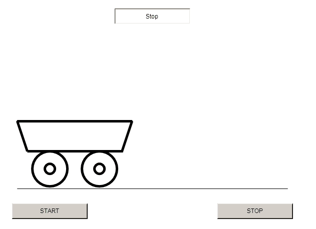

# Ambiente di sviluppo TwinCAT

Il tool principale per programmare i PLC Beckhoff è denominato TwinCAT che significa "The Windows Control and Automation Technology", ovvero "Tecnologia di controllo e automazione per Windows". TwinCAT è suddiviso in diversi moduli, ma i due principali sono:  
  - TwinCAT XAE  che sta per eXtended Automation Engineering ed è l'ambiente di sviluppo in cui vengono sviluppi i programmi che potranno poi essere eseguiti su un runtime TwinCAT.

  - TwinCAT XAR che sta per eXtended Automation Runtime ed è un runtime (piattaforma di esecuzione) locale su cui è possibile eseguire i programmi scritto con TwinCAT XAE prima di caricarli su un PC industriale dedicato.

## Installazione

[Scarica TC31-FULL-Setup.3.1.4024.44.exe](https://drive.google.com/file/d/1ebump_CRpeMDpodTEIvXfvRQp7_5mQY3/view?usp=sharing){:target="_blank"}

  <iframe src="https://www.youtube.com/embed/GzbMc2GxRYY" frameborder="0" allowfullscreen></iframe>

## Funzionalità

Per poter creare un nuovo progetto,  si apre l'ambiente di sviluppo TwinCAT XAE e si seleziona "Nuovo progetto". Si sceglie il template "Twincat XAE Project" e vi si assegna un nome.

  - Una volta creato il progetto, si seleziona la cartella "PLC", si fa click con il tasto destro e si sceglie la voce "Add new item". Si seleziona il template "Standard PLC Project" e vi si assegna un nome. Nei progetti più semplici si utilizza un unico progetto PLC e dunque è possibile assegnargli un nome generico come ad esempio "Plc". Il template "Standard PLC Project" si differenzia dal template "Empty PLC Project" per i seguenti motivi:

    - Il template "Standard PLC Project" crea delle sottocartelle per organizzare i file di progetto, utilizzando dei nomi standard (POUs, DTUs, GVLs, etc.).

    - Il template "Standard PLC Project" crea una POU di tipo Program chiamata "Main" con associato un Task già configurato per l'esecuzione ogni 10 ms. Il progetto è già quindi pronto per l'esecuzione su di un runtime e l'utente non deve preoccuparsi di creare e configurare il Task.

  - Prima di mandare in esecuzione il progetto, è necessario configurare le impostazione di "real time" o "tempo reale". Fare doppio click sulla cartella "SYSTEM", selezionare "Tempo reale" e premere il pulsante "Read from Target". Nella tabella sottostante apparirà la lista dei core della cpu presente nel target locale. Selezionare quindi uno solo dei core preferendo quelle di tipo "Isolated" se presenti.

  - Premere il pulsante "Activate configuration" che si trova in alto a sinistra ed il cui simbolo è una scala con una freccia. La funzione di questo pulsante Verranno dunque eseguite le seguenti operazioni:
  
    + Il progetto verrà attivato sul target selezionato e quindi sarà pronto per l'esecuzione

    + Carica il progetto sul target selezionato e lo configura per l'avvio automatico. Queste due operazioni sono effettuate soltanto se viene selezionata la voce "Autostart PLC Boot Project".
    
    + Verifica la presenza di verificare la presenza di una licenza idonea.

    + Modifica lo stato del target selezionato in "Run mode" (se confermato nell'apposito popup).

  - Se non avvenuto in automatico (ad esempio perché si è selezionato cancel nel popup di richiesta al punto precedente), portare il target in "Run mode".

  - Premere il pulsante di Login in alto a destra (rappresentato da una porta verde). Verrà richiesto di caricare il programma nel runtime (se in precedenza non è stata selezionata l'opzione "Autostart PLC Boot Project") e l'ambiente di sviluppo si porterà in modalità Debug. Gli editor saranno disattivati ed al loro posto ci saranno i tool per il debug del codice. 

  - Premere il pulsante "Start" in alto a destra (rappresentato da un'icona play verde) per iniziare l'esecuzione del programma

### Esecuzione di un programma

Per poter eseguire un programma all'interno di TwinCAT, bisogna effettuare le seguenti operazioni. N.B. quando viene utilizzato il template "Standard PLC Project" per la creazione di un progetto PLC, queste operazioni vengono effettuate in automatico.

  - Creazione di una POU di tipo Program
  - Creazione di un Task PLC e configurazione del numero di marcatori ciclo.
  - Associazione del Program con il Task.

Il programma verrà dunque eseguito ciclicamente ad intervalli pari al valore ricavato la moltiplicazione tra il "numero marcatori ciclo" (Es. 10) ed il "base time" (Es. 1 ms).
Durante ogni esecuzione vengono letti gli ingressi, viene eseguito il codice contenuto nel Program e vengono scritte le uscite. È importante che la durata di esecuzione del programma sia di molto inferiore all'intervallo tra un ciclo e l'altro in modo da non sovrapporre l'esecuzione di due Task successivi e generare dunque un errore di esecuzione.

### Impostazioni di tempo reale

Nelle impostazioni di tempo reale di TwinCAT, possiamo eseguire le seguenti operazioni:

- Leggere la configurazione del Target tramite il pulsante "Read from target" e poter scegliere su quale core andrà in esecuzione il Task PLC.

- Impostare dei core di tipo isolated tramite il pulsante "Set on target".

- Modificare il base time, il numero di marcatori ciclo ed altre impostazioni relative ai Task

- Visualizzare le statistiche di esecuzioni in modo da verificare che il tempo impiegato dall'esecuzione del programma non ecceda l'intervallo di esecuzione fra un task e l'altro.

### Stati del runtime

Un runtime TwinCAT può trovarsi in due stati:

- *Config mode*, identificato da un'icona di colore blu (o un led blu su un PC industriale Beckhoff). Quando il target si trova in questo stato, è possibile effettuare operazioni di configurazione, come ad esempio la scansione dei dispositivi di I/O collegati ad un PC industriale.

- *Run mode*, identificato da un'icona di colore verde (o un led blu su un PC industriale Beckhoff). Quando il runtime si trova in questo stato, è possibile eseguire un programma all'interno di esso.

### Gestione della licenza

TwinCAT mette a disposizione una licenza gratuita di durata settimanale che può essere utilizzata in ambito didattico. Questa licenza si rinnova in automatico nel momento in cui viene attivita una configurazione e non viene rilevata una licenza valida presente nel Target selezionato. Per generare la licenza è necessario inserire un CAPTCHA. Il CAPTCHA (Completely Automated Public Turing test to tell Computers and Humans Apart) è un tipo di misura di sicurezza che permette a TwinCAT di rilevare che l'utente è una persona e non un computer. Ci sono inoltre alcuni aspetti da tenere in considerazione:

- Nel momento in cui viene aggiunta una libreria o una funzionalità, verrà richiesto di generare la licenza relativa e verrà riproposto all'utente di inserire il CAPTCHA alla successiva attivazione della configurazione.

- Per poter generare la licenza è necessaria una perfetta sincronizzazione tra gli orari e la data del dispositivo Target ed il computer su cui si esegue TwinCAT XAE.

  <iframe src="https://www.youtube.com/embed/GVevocz6wfI" frameborder="0" allowfullscreen></iframe>

## HMI

  <iframe src="https://www.youtube.com/embed/1uTgwMqExw8" frameborder="0" allowfullscreen></iframe>

## Temporizzazioni

  <iframe src="https://www.youtube.com/embed/PPws5IBSID4" frameborder="0" allowfullscreen></iframe>

## Macchina a stati: semaforo

  <iframe src="https://www.youtube.com/embed/JZzBVN1RTCc" frameborder="0" allowfullscreen></iframe>

[Scarica il progetto](files/Progetto5-Macchina a Stati ST.tnzip)

## Macchina a stati: Carrello

Realizzare un progetto TwinCAT usando la struttura della macchina a stati in linguaggio ST che controlli il movimento in due versi (sinistra e destra) di un carrello con le seguenti caratteristiche:

- La HMI deve avere questo aspetto:

<figure markdown="span">
  { width="300" }
  <figcaption markdown="span">
    HMI del progetto Carrello
  </figcaption>
</figure>

 - Il Function Block chiamato FB_StateMachine ha queste caratteristiche:

    * Gli stati sono 4: stop con prossimo movimento a destra (stato iniziale), movimento a destra, movimento a sinistra, stop con prossimo movimento a sinistra.
    * Gli input sono 4: pulsante start, pulsante stop, FC sinistra e FC destra. La gestione dei sensori finecorsa è gestita dalla posizione del carrello sullo schermo.
    * Gli output sono 2: Motore destra e Motore sinistra.

  - Il Function Block chiamato FB_VisuManager ha queste caratteristiche:

    * Gestisce la posizione del carrello (coordinata x)
    * Gli input sono 2: Motore destra e Motore sinistra che userà per incrementare o decrementare la coordinata.
    * Gli output sono 2: FC destra e FC sinistra a seconda se il carrello ha raggiunto il punto iniziale o quello finale.

## Esecuzione su target remoto