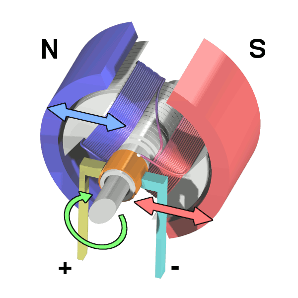

## Motore in corrente continua

Un motore in corrente continua è costiuito da uno statore a magnete permanente e da un rotore in ferro sul quale sono presenti degli avvolgimenti.

- Uno statore a magnete permamente
- Un rotore in ferro sul quale sono presenti degli avvolgimenti ed è la parte che ruota. È detto anche armatura.
- Il commutatore si occupa di commutare il verso della corrente per sostenere la rotazione stabilendo un collegamento tra rotore e spazzole
- Le spazzole sono collegate alla fonte di alimentazione

<figure markdown="span">
  { width="300" }
  <figcaption markdown="span">
    Motore in CC [Wapcaplet](https://en.wikipedia.org/wiki/User:Wapcaplet)
    [CC BY-SA 3.0](http://creativecommons.org/licenses/by-sa/3.0/)
  </figcaption>
</figure>

Un motore in corrente continua può essere rappresentato elettricamente dal seguente circuito:

<figure markdown="span">
  { width="300" }
  <figcaption markdown="span">
    Circuito equivalente del motore in CC
  </figcaption>
</figure>

dove $V_A$ è la tensione applicata all'armatura, $R$ è la resistenza delle spire, $L$ è l'induttanza delle spire. $E_C$ rappresenta la forza controelettromotrice che si oppone alla tensione di armatura quando il motore ruota.

Trascurando l'induttanza $L$ che a regime si comporta come un cortocircuito, otteniamo la seguente equazione alla maglia:

$$ V_A = R\cdot I + E_C $$

Si può dimostrare che la forza controelettromotrice è legata alla velocità angolare di rotazione $\omega$ tramite una costante $K_E$ detta costante elettrica che dipende dal flusso magnetico e dal numero di spire dell'avvolgimento.

$$ E_C = K_E \cdot \omega $$

e dunque l'equazione diventa:

$$ V_A = R\cdot I + K_E \cdot \omega $$

La coppia motrice del motore $C$ è data dalla relazione:

$$ C_M = K_T \cdot I $$

dove $K_T$ è la costante meccanica del motore ed ha lo stesso valore, ma unità di misura diversa.

### Funzionamento a vuoto

Supponiamo che il motore sia inizialmente fermo, dunque la sua velocità angolare $\omega$ vale 0 e non sia applicato alcun carico al rotore. Se viene applicata una tensione $V_A$ ai capi dell'armatura, si ottiene una corrente $I_S$, detta corrente di spunto che vale:

$$ I_S = \frac{V_A}{R} $$

e si ha una coppia $C_S$ detta coppia di spunto che vale:

$$ C_S = K_T \cdot I_S = K_T \cdot  \frac{V_A}{R} $$

A causa di questa coppia, il motore inizia a ruotare con velocità angolare $\omega (t)$ variabile nel tempo e quindi viene generata una forza controelettromotrice che si oppone alla tensione di alimentazione:

$$ E_C (t) = K_E \cdot \omega(t) $$

Dopo un certo periodo di tempo $T_A$, il motore raggiungerà la velocità angolare di regime $\omega_0$ detta anche velocità a vuoto. 

\begin{equation}
  \omega_0 = \frac{V_A}{K_E}
  \label{eq:omega0}
\end{equation}

In assenza di carico, ovvero di coppia resistente, si avrà che la forza controelettromotrice avrà raggiunto il valore della tensione di alimentazione, azzerando la corrente $I$.

$$E_C = V_A \rightarrow V_A = K_E \cdot \omega_R \rightarrow \omega_0 = \frac{V_A}{K_E} $$

Essendo la corrente di regime $I_R$ = 0, si ha che la coppia motrice va a zero:

$$ C_0 = K_T \cdot I_0 = 0 $$

Nella realtà, questa situazione non può verificarsi, in quanto sono sempre presenti attriti e perdite magnetiche. Per tale motivo, vi è una corrente $I_0 \neq 0$ dato che la coppia motrice deve compensare la coppia resistente.

<figure markdown="span">
  { width="300" }
  <figcaption markdown="span">
    Motore in CC [Abnormaal](https://commons.wikimedia.org/wiki/User:Abnormaal)
    [CC BY-SA 3.0](http://creativecommons.org/licenses/by-sa/3.0/)
  </figcaption>
</figure>

### Funzionamento sotto carico

Se all'albero del motore viene applicata una coppia contraria al verso di rotazione $C_L$ detta coppia resistente o frenante, la velocità angolare $\omega$ diminuisce e viene a circolare una corrente:

$$ I= \frac{V_A - K_E \cdot \omega}{R} $$

Tale corrente, produce una coppia motrice che a regime sarà uguale alla coppia resistente $C_M = C_L$. Dato che:

$$ I = \frac{C_L}{K_T}  $$

Dall'equazione alla maglia, abbiamo:

$$ E_C = V_A -  R\cdot I  = V_A -  R\cdot \frac{C_L}{K_T} $$

Se la posto di $E_C$  sostituiamo $K_E \cdot \omega$, otteniamo:

$$ \omega  = \frac{V_A}{K_E} - R\cdot \frac{C_L}{K_T^2} $$

Sostituendo $\omega_0$ dall'equazione $\eqref{eq:omega0}$ e ponendo:

$$ H = \frac{R}{K_T^2} $$

otteniamo:

$$ \omega  = \omega_0 - C_L \cdot H $$

$H$ è detta costante motore ed è un indice di qualità del motore. Più piccolo è $H$, minore sarà la perdita di velocità angolare a parità di coppia resistente.

### Regime dinamico

I motore in corrente continua è un sistema dinamico caratterizzato da due costanti di tempo:

- la costante di tempo elettrica $\tau_e$

$$ \tau_e = \frac{L}{R} $$

- la costante di tempo meccanica $\tau_m$

$$ \tau _m = \frac{R \cdot J } {K_T \cdot K_E} $$

dove $J$ è il momento di inerzia complessivo del motore collegato al carico.

La funzione di trasferimento del motore in corrente continua, nel funzionamento a vuoto, può essere quindi espressa come:

$$ G(s) = \frac{\Omega (s)}{V_A (s)} = \frac{\frac{1}{K_E}}{(1 + s\cdot \tau_m) \cdot (1 + s\cdot \tau_m) }$$

e generalmente si ha che $\tau_m \gg \tau_e$.
