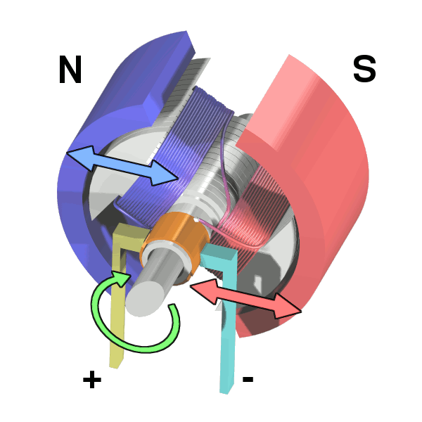

# Controllo di un motore in corrente continua

In questo capitolo, andremo ad analizzare un esempio di controllo analogico per un motore a corrente continua che fa uso di una dinamo tachimetrica.

## Motore in corrente continua a magnete permamente

<figure markdown="span">
  { width="300" }
  <figcaption markdown="span">
    Motore in CC [Wapcaplet](https://en.wikipedia.org/wiki/User:Wapcaplet)
    [CC BY-SA 3.0](http://creativecommons.org/licenses/by-sa/3.0/)
  </figcaption>
</figure>
