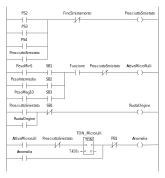

# Esami di Stato

## Sessione ordinaria 2018

Il candidato svolga la prima parte della prova e due tra i quesiti proposti nella
seconda parte. 

### Prima parte

All’interno di un prosciuttificio è presente una stazione di smistamento dei prosciutti per
procedere alle operazioni di marchiatura selezione per la vendita e timbratura.
I prosciutti vengono posti su un nastro trasportatore e arrivano su una piattaforma girevole
e provvista di una cella di carico con portata di fondo scala pari a 150 N, dove vengono
pesati e successivamente distribuiti in funzione del loro peso.
Il nastro trasportatore di arrivo alla piattaforma si ferma per 5 secondi per permettere
l’operazione di pesatura, al termine della quale, in base al peso, il prosciutto viene
smistato.
I prosciutti di peso inferiore a 5 kg vengono convogliati verso uno scivolo di raccolta posto
a 180° per destinarli ad altri usi.
Gli altri vengono indirizzati verso due nastri trasportatori, posti rispettivamente a 90° e
270° rispetto al nastro di arrivo attorno alla piattaforma.
In particolare se il peso è compreso tra 5 e 10 kg la base ruota di 90° verso destra, se il
peso supera i 10 kg la base ruota di 90° verso sinistra.
Alla fine dei due nastri è posto un contenitore di raccolta, che una volta pieno determinerà
un arresto temporaneo del sistema per permettere all’operatore la sua sostituzione.
La rotazione della piattaforma è affidata ad un opportuno motore, mentre lo spostamento
del prosciutto dalla base ruotante alla linea di destinazione è affidato ad una serie di micro
rulli solidali alla base rotante stessa e azionati da un ulteriore motore.
Ogni linea di smistamento è provvista di un opportuno sensore che permette il conteggio
dei prosciutti commerciabili da quelli destinati ad altri usi.
Il candidato, fatte le ulteriori ipotesi aggiuntive che ritiene necessarie:

1. descriva l’impianto attraverso uno schema e individui i dispositivi necessari alla sua
realizzazione, fornendo una tabella di I/O rappresentante i principali segnali elettrici di
controllo;

2. rappresenti mediante un diagramma di flusso di propria conoscenza, l’algoritmo di
gestione dell’impianto;

3. elabori il programma in grado di gestire l’automatismo utilizzando un sistema
programmabile di propria conoscenza;

4. progetti un sistema in grado di effettuare una stima percentuale dei prosciutti
commerciabili da quelli destinati ad altri usi.
Inoltre, il candidato progetti un idoneo sistema di segnalazioni luminose nelle fasi di
movimentazione dei nastri, nonché i pulsanti di marcia e arresto dell’impianto.

**Soluzione:**

Di seguito viene riportato lo schema dell'impianto.

<figure markdown="span">
  { width="500" }
  <figcaption markdown="span">
    Schema dell'impianto
  </figcaption>
</figure>

Di seguito, sono riportatati i dispositivi di input:

| Codice      | Descrizione                          | Tipo segnale |
| ----------- | ------------------------------------ | ----------- |
| PB1      | Pulsante di avvio NA                 | Digitale 24V|
| PB2      | Pulsante di stop (gestito) NC        |Digitale 24V|
| PBE      | Pulsante di emergenza a fungo NC     |Digitale 24V|
| PS1       | Fotocellula rilevamento prosciutto linea di arrivo|Digitale 24V|
| PS2       | Fotocellula rilevamento prosciutto contenitore di raccolta da 5 a 10 Kg|Digitale 24V|
| PS3       | Fotocellula rilevamento prosciutto scivolo di raccolta minore di 5 Kg|Digitale 24V|
| PS4       | Fotocellula rilevamento prosciutto contenitore di raccolta maggiore di 10 Kg|Digitale 24V|
| FS1       | Sensore di riempimento contenitore di raccolta da 5 a 10 Kg|Digitale 24V|
| FS2       | Sensore di riempimento contenitore di raccolta maggiore di 10 Kg|Digitale 24V|
| SB1       | Sensore di finecorsa che indica la rotazione di 0°|Digitale 24V|
| SB2       | Sensore di finecorsa che indica la rotazione di 90° a destra|Digitale 24V|
| SB3       | Sensore di finecorsa che indica la rotazione di 90° a sinistra|Digitale 24V|
| LC1       | Cella di carico che misura il peso del prosciutto.|Analogico 10V|

Di seguito, sono riportatati i dispositivi di output:

| Codice      | Descrizione                          | Tipo segnale |
| ----------- | ------------------------------------ | ----------- |
| M1          | Motore nastro trasportatore linea di arrivo                 | Digitale 24V|
| M2          | Motore nastro trasportatore linea da 5 a 10 Kg                 | Digitale 24V|
| M3          | Motore nastro trasportatore linea maggiore di 10 Kg                 | Digitale 24V|
| M4          | Motore piattaforma girevole                 | Digitale 24V|
| M5          | Motore micro rulli               | Digitale 24V|
| L1          | Lampada di segnalazione bianca (macchina in tensione)               | Digitale 24V|
| L2          | Lampada di segnalazione verde (macchina in funzione)               | Digitale 24V|
| L3          | Lampada di segnalazione blu (azione richiesta)               | Digitale 24V|
| L4          | Lampada di segnalazione gialla (anomalia)               | Digitale 24V|
| L5          | Lampada di segnalazione rossa (condizione di emergenza)               | Digitale 24V|


La cella di carico viene condizionata usando un amplificatore per strumentazione (INA111) in modo da ottenere una tensione di 10V in corrispondenza del fondoscala della cella di carico (15 Kg). In tal modo, ad ogni Volt corrisponderanno 1,5 Kg. Di seguito viene riportato lo schema di principio dell'amplificatore per strumentazione:

Di seguito sono riportate tutte le variabili globali, ovvero disponibili nell'intero progetto e possono essere utilizzate per la HMI.

``` iecst title="GVL"
VAR_GLOBAL
  //input
  PB1: BOOL;
  PB2: BOOL;
  PBE: BOOL;
  PS1: BOOL;
  PS2: BOOL;
  PS3: BOOL;
  PS4: BOOL;
  FS1: BOOL;
  FS2: BOOL;
  SB1: BOOL;
  SB2: BOOL;
  SB3: BOOL;
  LC1: REAL; //Valore di tensione da 0V a 10V (0 Kg - 15 Kg)

  //output
  L1: BOOL;
  L2: BOOL;
  L3: BOOL;
  L4: BOOL;
  L5: BOOL;
  M1 : BOOL;
  M2 : BOOL;
  M3 : BOOL;
  M4 : BOOL;
  M5 : BOOL;
END_VAR
```

Di seguito, invece, sono riportate le variabile del PRG MAIN, che sono visibili solo all'interno dello stesso PROG.

``` iecst title="MAIN"
VAR
  StopRichiesto: BOOL;
  Anomalia: BOOL;
  Emergenza: BOOL;
  Funzione: BOOL;
  Smistamento: BOOL;
  Rotazione: BOOL;
  AttivaMicroRulli: BOOL;
  FineSmistamento: BOOL;
  FinePesatura: BOOL;
  RuotaOrigine: BOOL;
  PesoMin5: BOOL;
  PesoMag10: BOOL;
  PesoIntermedio: BOOL;
  ProsciuttoSmistato: BOOL;
  //Timer
  TON_PS1: TON;
  TON_Pesatura: TON;
  TON_MicroRulli: TON;
END_VAR
```

Nella prima parte del programma, vengono gestiti i pulsanti e le luci di segnalazione. La variabile Stop indica che è stato richiesto uno stop, che può avvenire perché il pulsante di stop è stato premuto, oppure perché uno dei contenitori è pieno. Il pulsante di stop ha effetto solo una volta terminato lo smistamento del prosciutto corrente in modo da lasciare la macchina in uno stato gestito.

<figure markdown="span">
  { width="500" }
  <figcaption markdown="span">
    Programma Ladder: gestione dei pulsanti e segnalazioni.
  </figcaption>
</figure>

Nella seconda parte del programma, vengono gestiti i motori. Si è ipotizzato che il motore M1 debba fermarsi una volta iniziata la procedura di smistamento, mentre i motori M2 ed M3 possono restare sempre in movimento durante il funzionamento dell'impianto. Inoltre, il motore M1 richiede che la piattaforma sia ruotata nella posizione di partenza  (segnale SB1 a livello alto) per poter funzionare.

<figure markdown="span">
  { width="500" }
  <figcaption markdown="span">
    Programma Ladder: gestione dei motori.
  </figcaption>
</figure>

Nella terza parte del programma, viene gestito la pesatura del prosciutto. Un timer TON di 200 ms permette di evitare falsi positivi sull'effettiva presenza del prosciutto sulla linea di arrivo. Si ritiene sufficiente l'inerzia del motore del nastro per trasferire il prosciutto sulla piattaforma girevole. Tale aspetto andrà verificato in fase di collaudo dell'impianto e può essere modificato inserendo un timer di tipo TOF per lo spegnimento del motore M1.

<figure markdown="span">
  { width="500" }
  <figcaption markdown="span">
    Programma Ladder: gestione della pesatura.
  </figcaption>
</figure>

Nella quarta parte del programma, viene gestita la rotazione della piattaforma. Se il peso rilevato è minore di 5 Kg, non vi sarà alcuna rotazione. In questa parte di programma viene gestita anche la rotazione verso la posizione iniziale, effettuata alla fine dello smistamento.

<figure markdown="span">
  { width="500" }
  <figcaption markdown="span">
    Programma Ladder: rotazione della piattaforma.
  </figcaption>
</figure>

Nella quinta parte del programma, viene gestito lo smistamento del prosciutto nella linea corretta. Come prima cosa vengono attivati i micro rulli ed infine viene verificata l'effettiva presenza del prosciutto nel contenitore corretto tramite il segnale della fotocellula. Nel caso in cui il motore dei micro rulli rimanha acceso per più di 10 secondi senza che venga rilevata la presenza di un prosciutto in uno dei contenitori, l'impianto passa in condizione di anomalia e si ferma. In tal caso, l'operatore dovrò dapprima verificare la presenza di prosciutti bloccati e successivamente verificare il funzionamento delle fotocellule.

<figure markdown="span">
  { width="500" }
  <figcaption markdown="span">
    Programma Ladder: smistamento del prosciutto.
  </figcaption>
</figure>


### Seconda parte