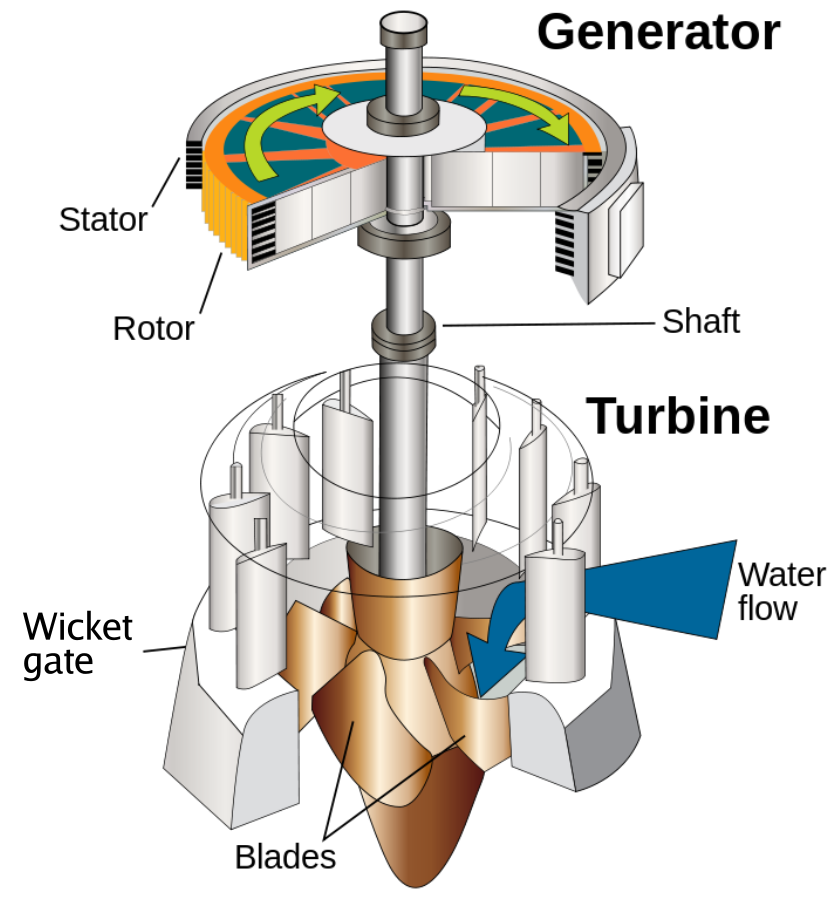

# Circuiti in corrente alternata

Nei circuiti elettrici in corrente continua, la tensione applicata dal generatore rimane costante nel tempo. Ad esempio, una batteria da 9 V applica, sotto certe approssimazioni, una tensione costante fino alla scarica. Nei circuiti elettrici in corrente alternata, il valore di tensione cambia nel tempo in maniera periodica, assumendo sia valori positivi che negativi. La forma d'onda più utilizzata è il segnale sinusoidale. Nelle nostre case la tensione viene distribuita in forma sinusoidale con un valore efficace di 230 V ed una frequenza di 50 Hz.

## Caratteristiche dei segnali sinusoidali

Un segnale di tensione sinusoidale è un segnale periodico rappresentato dalla seguente espressione:

$$ v(t) = A \cdot \sin (\omega t + \varphi) $$

oppure

$$ v(t) = A \cdot \sin (2 \pi f t + \varphi) $$

dove:

- $A$ è l'ampiezza del segnale e corrisponde al suo valore massimo
- $\omega$ è la pulsazione espressa in radianti al secondo (rad/s)
- $f$ è la frequenza espressa in hertz (Hz) ed è il reciproco del tempo. Si può ricavare la frequenza dalla pulsazione secondo la relazione: $\omega = 2 \pi f$
- $\varphi$ è la fase del segnale che indica la traslazione rispetto all'asse delle ordinate. Nella figura la fase vale 0. Valori positivi di $\varphi$ spostano il grafico verso sinistra (anticipano il segnale) e valori negativi di $varphi$ spostano il grafico verso destra (ritardano il segnale).

<figure markdown="span">
  { width="500" }
  <figcaption markdown="span">
    Segnale sinusoidale
  </figcaption>
</figure>

[Scarica il file excel con la simulazione](files/sinusoide.xlsx){:target="_blank"}

## Valore efficace

Nella trattazione dei segnali di tensione sinusoidale, si fa riferimento al valore efficace $V_{eff}$ che si calcola con la seguente formula:

$$ V_{eff} = \frac{A}{\sqrt(2)} $$

Il valore efficace di un segnale alternato è equivalente al valore della corrente continua costante, in grado di produrre la stessa dissipazione di potenza in un carico resistivo. É quindi utilizzato per calcolare facilmente la potenza dissipata da un utilizzatore di resistenza $R$ alimentato in corrente alternata. Si indica generalmente con $V$, dato che è il parametro più usato quando si parla di tensione alternata. Il valore efficace è a volte anche rappresentato con la sigla rms, dall'inglese root mean square.

$$ P = \frac{V^2}{R} \quad [W] $$

## Generazione della tensione sinusoidale

Le centrali elettriche trasformano l'energia meccanica delle turbine in energia elettrica tramite l'utilizzo di macchine elettriche rotanti dette **alternatori**. Queste macchine sfruttano il fenomeno dell'induzione elettromagnetica, ovvero nella generazione di una corrente elettrica in presenza di un campo magnetico rotante.

Gli alternatori di corrente sono macchine elettriche rotanti che permettono di trasformare l'energia meccanica prodotta da un motore sotto forma di corrente alternata. Tutto questo sfruttando il fenomeno dell'induzione elettromagnetica.

<figure markdown="span">
  { width="300" }
  <figcaption markdown="span">
    Alternatore collegato ad una turbina
  </figcaption>
</figure>

<figure markdown="span">
  { width="500" }
  <figcaption markdown="span">
    Generazione della tensione sinusoidale
  </figcaption>
</figure>

## Esercizi

1. Un elettrodomestico possiede una resistenza elettrica di $20 \; \Omega$ e viene alimentato con una tensione alternata di valore massimo di $155{,}6 \; V$. Calcolare il costo dell'energia elettrica per un funzionamento di 20 minuti considerando un presso dell'energia di $0{,}2 \; \text{€/kWh}$