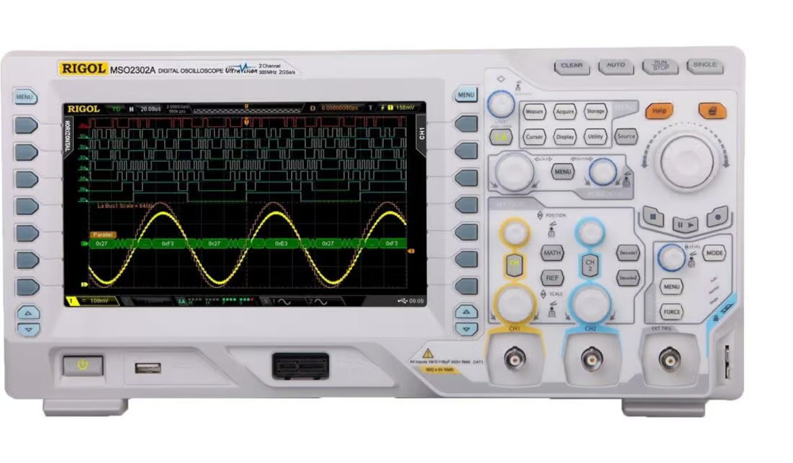

# Strumentazione di laboratorio

## Oscilloscopio Rigol DS2000A

L'oscilloscopio digitale è uno strumento di misura elettronico utilizzato per visualizzare e analizzare segnali elettrici variabili nel tempo.

<figure markdown="span">
  { width="300" }
  <figcaption markdown="span">
    Oscilloscopio Rigol DS2000A
  </figcaption>
</figure>

[Scarica il manuale](files/ds2000a_userguide_en.pdf){:target="_blank"}

## Generatore di funzioni Rigol DG1022

Il generatore di funzioni è uno strumento utilizzato per generare segnali elettrici di forma d'onda specifica, come onde sinusoidali, quadrate, triangolari o altre forme d'onda più complesse. 

<figure markdown="span">
  { width="300" }
  <figcaption markdown="span">
    Generatore di funzioni Rigol DG1022
  </figcaption>
</figure>

[Scarica il manuale](files/DG1022_UserGuide_EN.pdf){:target="_blank"}
